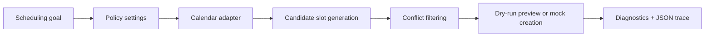

# Policy-Driven AI Calendar Orchestration PoC

A Python proof of concept that turns a scheduling goal into a conflict-aware calendar recommendation using configurable rules, dry-run simulation, diagnostics, and deterministic slot selection.

This project is intentionally scoped as a prototype. It focuses on the orchestration layer around scheduling decisions: how a request moves through policy checks, calendar context, conflict filtering, and traceable output before any calendar action is taken.

## Project Summary

The application simulates a calendar scheduling workflow. Given a goal such as:

> "Schedule a 30-minute interview prep block this week."

the system checks configurable scheduling rules, reads busy blocks from a mock calendar adapter, finds available candidate slots, and returns either a dry-run preview or a mock event creation result.

The goal is not to build a full calendar product. The goal is to show how an automation workflow can be made safer, easier to inspect, and easier to test.

## Problem It Solves

Calendar automation can become risky when it acts like a black box. A useful scheduling assistant should be able to answer basic questions:

- What rules did it follow?
- Which conflicts did it check?
- Why did it choose this time?
- What would happen before anything is actually created?
- Can the behavior be tested?

This project demonstrates those ideas in a small, focused codebase.

## What It Does

- Loads scheduling policy from configuration.
- Uses a deterministic mock calendar adapter for simulation.
- Generates candidate slots inside a future scheduling window.
- Applies work-hour, lunch-avoidance, minimum-notice, and conflict rules.
- Selects the earliest valid slot.
- Supports dry-run previews before event creation.
- Writes JSON trace files with decision context, diagnostics, and timing metrics.
- Includes tests for rule behavior and simulation trace invariants.

## Demo / Screenshots

Screenshots can be added here as the project presentation is finalized. Suggested visuals:

| Screenshot | What it should show |
| --- | --- |
| Example request | A scheduling goal passed into the CLI |
| Rule/conflict check | Candidate slots filtered by policy and busy blocks |
| Dry-run result | The selected slot, alternatives, and event preview |
| Diagnostics output | Trace JSON with metrics and decision context |

Recommended screenshot flow:

1. Run the simulation command.
2. Capture the terminal result.
3. Open the generated `runs/sim_*.json` trace.
4. Capture the result, diagnostics, and metrics sections.

## Quick Start

Install the project dependencies:

```bash
python -m pip install -e ".[dev]"
```

Run a dry-run simulation:

```bash
python -m src.app simulate --dry-run
```

Run with a custom scheduling goal:

```bash
python -m src.app simulate --dry-run --goal "Schedule a 30-minute interview prep block this week."
```

Run tests:

```bash
python -m pytest
```

Note: `tests/test_regression.py` expects at least one generated simulation trace. If needed, run the dry-run command before running the full test suite.

## Example Workflow

1. A scheduling goal is passed to the CLI.
2. The engine loads scheduling policy from `src/config.py`.
3. The mock calendar adapter returns deterministic busy blocks.
4. Candidate slots are generated using work hours, lunch avoidance, duration, notice period, and step size.
5. Candidates that overlap busy blocks are rejected.
6. The earliest valid slot is selected.
7. In dry-run mode, the event body is previewed instead of created.
8. A trace file is written to `runs/` for review and regression testing.

## How It Works



Core modules:

| File | Purpose |
| --- | --- |
| `src/app.py` | CLI entry point |
| `src/simulate.py` | Runs the simulation and writes trace artifacts |
| `src/config.py` | Central scheduling settings |
| `src/orchestration/policy.py` | Scheduling policy data model |
| `src/orchestration/rules.py` | Candidate generation and conflict filtering |
| `src/orchestration/engine.py` | Main orchestration flow |
| `src/diagnostics.py` | Structured diagnostic events |
| `src/tools/mock_calendar.py` | Deterministic mock calendar adapter |
| `tests/` | Rule tests and trace invariant tests |

## Example Trace

Each simulation writes a trace file to `runs/`. A shortened example looks like this:

```json
{
  "mode": "simulate",
  "goal": "Schedule a 30-minute interview prep block this week.",
  "dry_run": true,
  "result": {
    "status": "dry_run",
    "chosen": {
      "start": "2026-01-06T09:00:00-06:00",
      "end": "2026-01-06T09:30:00-06:00"
    },
    "alternatives": []
  },
  "metrics": {
    "partner_list_events_ms": 1.2,
    "generate_candidates_ms": 0.4,
    "filter_conflicts_ms": 0.1
  }
}
```

Actual timestamps and metrics will vary by run.

## Why This Matters

The project shows how automation can support a business process without hiding the decision logic. The scheduling decision is constrained by explicit rules, previewed before execution, and recorded in a trace that can be reviewed or tested.

That makes the workflow easier to trust than a one-step automation that immediately modifies a calendar.

## Salesforce / Business Technology Relevance

This is not a Salesforce integration. The transferable skills are the important part:

- Translating workflow requirements into business rules.
- Designing automation that supports user review and trust.
- Separating decision logic from integration logic.
- Using diagnostics and trace output to make automated decisions easier to explain.
- Testing process behavior instead of relying only on manual demos.
- Thinking about responsible AI-assisted decision support in practical business workflows.

## Tech Stack

- Python 3.10+
- Pydantic Settings for configuration
- python-dateutil for timezone-aware datetime handling
- structlog for structured logging
- Rich for CLI output
- pytest for tests

## What I Learned

- How to separate scheduling policy from execution logic.
- How to make an automation workflow inspectable through dry-run output and trace files.
- How to test deterministic parts of an orchestration workflow.
- How to design around user trust by showing why a recommendation was selected.
- How to document a technical proof of concept for both engineering and business audiences.

## Future Improvements

- Implement the Google Calendar adapter currently reserved in `src/tools/google_calendar.py`.
- Add a lightweight parser that turns common scheduling phrases into duration or date-window settings.
- Add richer CLI output for candidate slots and rejected conflicts.
- Add generated screenshots or demo GIFs to the README.
- Add more tests for edge cases such as weekends, restrictive policies, and no-slot outcomes.
- Add a small web or notebook demo for non-technical reviewers.

## Status

Proof of concept.

Current implementation:

- Uses a deterministic mock calendar adapter.
- Supports dry-run simulation and mock event creation.
- Writes trace files for diagnostics and regression-style checks.
- Includes focused tests for scheduling rules and trace structure.

Not currently implemented:

- Live Google Calendar OAuth integration.
- Full natural-language parsing.
- Production deployment.
- Multi-user support.

## GitHub About

Policy-driven calendar scheduling PoC that converts a scheduling goal into conflict-aware slot recommendations using configurable rules, dry-run simulation, diagnostics, and deterministic orchestration logic.

## Suggested Topics

`python` `calendar` `workflow-automation` `scheduling` `business-rules` `dry-run` `diagnostics` `responsible-ai` `process-automation` `portfolio-project` `pytest` `pydantic`

Resume bullets and interview notes are available in `docs/portfolio_notes.md`.
