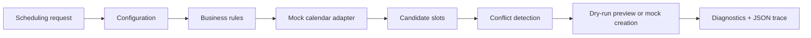

# Policy-Driven Calendar Orchestration PoC

A Python proof of concept that converts a scheduling request into a conflict-aware calendar recommendation using configurable business rules, dry-run simulation, diagnostics, and deterministic slot selection.

## Project Overview

This repository demonstrates a small scheduling orchestration workflow. A scheduling request is passed to the CLI as text, and the system uses explicit configuration and deterministic rules to recommend an available calendar slot.

The current implementation uses a deterministic mock calendar adapter. It does not connect to a live Google Calendar account, does not meaningfully interpret arbitrary natural language, and is not designed for production deployment or multiple users.

## Problem

Scheduling automation is easier to trust when the decision path is visible. A practical workflow should make it clear which rules were applied, what conflicts were checked, what slot was selected, and what would happen before any calendar action is taken.

This proof of concept focuses on that decision process: configuration, conflict detection, dry-run previews, diagnostics, and testable behavior.

## Features

- Configurable scheduling rules for work hours, lunch avoidance, notice period, duration, slot step size, and maximum suggestions.
- Deterministic mock calendar adapter for repeatable local simulation.
- Candidate slot generation within a future scheduling window.
- Conflict filtering against existing busy blocks.
- Earliest-valid-slot selection.
- Dry-run previews that show the proposed event body without creating an event.
- JSON execution traces with policy, result, diagnostics, and timing metrics.
- Automated tests for scheduling rules and trace invariants.

## Demo

Run a dry-run simulation:

```bash
python -m src.app simulate --dry-run --goal "Schedule a 30-minute interview preparation block this week."
```

The terminal prints a short completion summary. Detailed results such as the selected slot, alternatives, diagnostics, and timing metrics are stored in the generated JSON trace under `runs/`.

Useful trace sections:

- `decision_explanation`: policy values, selection rule, chosen-slot reason, and rejected summaries
- `result`: dry-run status, chosen slot, alternatives, and event body preview
- `diagnostics`: structured workflow events
- `metrics`: timing measurements for calendar lookup, candidate generation, and conflict filtering

## Quick Start

Install dependencies:

```bash
python -m pip install -e ".[dev]"
```

Run the simulation:

```bash
python -m src.app simulate --dry-run --goal "Schedule a 30-minute interview preparation block this week."
```

Run tests:

```bash
python -m pytest
```

`tests/test_regression.py` expects at least one simulation trace in `runs/`. If the trace is missing, run the simulation command first and then rerun the test suite.

## Workflow

1. A scheduling request is passed to the CLI.
2. The engine loads scheduling settings from configuration.
3. The mock calendar adapter returns deterministic busy blocks.
4. Candidate slots are generated inside the configured date window.
5. Business rules filter candidates by weekday, work hours, lunch window, and minimum notice.
6. Conflict detection removes candidates that overlap busy blocks.
7. The earliest remaining slot is selected.
8. Dry-run mode returns an event preview instead of creating an event.
9. The run is written to a JSON trace for review and testing.



## Project Structure

| Path | Purpose |
| --- | --- |
| `src/app.py` | CLI entry point |
| `src/config.py` | Scheduling settings and environment-based configuration |
| `src/simulate.py` | Simulation runner and trace writer |
| `src/diagnostics.py` | Structured diagnostic events |
| `src/orchestration/policy.py` | Scheduling policy data model |
| `src/orchestration/rules.py` | Candidate generation and conflict filtering |
| `src/orchestration/engine.py` | Main scheduling workflow |
| `src/tools/mock_calendar.py` | Deterministic mock calendar adapter |
| `src/tools/google_calendar.py` | Reserved for a possible future calendar adapter |
| `tests/` | Rule tests and trace invariant tests |
| `docs/` | Architecture, runbook, failure notes, and portfolio notes |

## Example Trace

Each simulation writes a trace file to `runs/sim_*.json`. A shortened example of the structure:

```json
{
  "mode": "simulate",
  "goal": "Schedule a 30-minute interview preparation block this week.",
  "dry_run": true,
  "decision_explanation": {
    "selection_rule": "Earliest valid slot satisfying policy + conflict constraints",
    "chosen_slot_reason": "Selected earliest available slot under policy."
  },
  "result": {
    "status": "dry_run",
    "chosen": {
      "start": "2026-01-06T09:00:00-06:00",
      "end": "2026-01-06T09:30:00-06:00"
    }
  },
  "metrics": {
    "partner_list_events_ms": 1.2,
    "generate_candidates_ms": 0.4,
    "filter_conflicts_ms": 0.1
  }
}
```

Actual timestamps, selected slots, alternatives, and metrics vary by run.

## Design Decisions

- **Configuration before execution:** Scheduling behavior is controlled through explicit settings instead of hidden assumptions.
- **Mock adapter first:** The deterministic mock calendar makes the workflow repeatable for local testing and demos.
- **Dry-run by default for review:** The project can show the proposed event body before any create action is simulated.
- **Traceable decisions:** JSON traces preserve the policy, result, diagnostics, and metrics for review.
- **Separation of concerns:** Policy, rules, calendar access, engine coordination, and diagnostics live in separate modules.

## Business Technology Relevance

This project demonstrates business-process automation skills without claiming a specific platform integration. It shows how workflow requirements can become configurable rules, how process decisions can be checked against context, and how users can review recommendations before action is taken.

Relevant skills demonstrated:

- translating workflow requirements into business rules
- separating configuration from execution logic
- building conflict-aware scheduling logic
- supporting dry-run review before action
- using diagnostics and traces for transparency
- testing deterministic workflow behavior
- documenting system scope and limitations clearly

## Technology

- Python 3.10+
- Pydantic Settings
- python-dateutil
- structlog
- Rich
- pytest

## Testing

The test suite covers:

- candidate generation under scheduling policy constraints
- conflict filtering for overlapping busy blocks
- simulation trace structure and core invariants

Run:

```bash
python -m pytest
```

## What I Learned

- How to convert scheduling requirements into explicit configuration and rules.
- How to separate policy, calendar access, decision logic, and execution behavior.
- How to make a workflow easier to inspect with dry-run previews and trace files.
- How to test deterministic parts of a scheduling workflow.
- How to document a proof of concept honestly for both technical and business readers.

## Future Improvements

- Implement a real calendar adapter as an optional integration.
- Add a small parser for structured scheduling inputs such as duration or preferred date range.
- Improve CLI output so selected slots, alternatives, and diagnostics are easier to read without opening the trace file.
- Add tests for weekend handling, restrictive policies, and no-slot outcomes.
- Add real screenshots after capturing command output and trace review screens.

## Current Status

Proof of concept.

Implemented:

- deterministic mock calendar simulation
- configurable scheduling policy
- candidate generation
- conflict detection
- dry-run previews
- JSON execution traces
- diagnostics
- automated tests

Not implemented:

- live Google Calendar account connection
- full natural-language parsing
- production deployment
- multi-user support

## Portfolio Notes

Recommended GitHub About description:

> Policy-driven calendar scheduling PoC with configurable business rules, conflict detection, dry-run previews, diagnostics, and auditable execution traces.

Suggested GitHub topics:

`python` `calendar` `scheduling` `workflow-automation` `business-rules` `dry-run` `diagnostics` `process-automation` `pytest` `pydantic`

Resume bullets and interview notes are available in `docs/portfolio_notes.md`.
