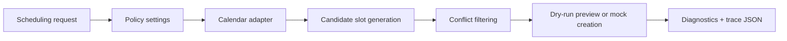

# Architecture

This project is a small orchestration proof of concept for calendar scheduling. It separates policy, calendar access, slot generation, conflict checking, and trace output so the decision path is easy to inspect.

## Flow

## Main Components

| Component | File | Role |
| --- | --- | --- |
| CLI | `src/app.py` | Parses commands and starts simulation runs. |
| Simulation runner | `src/simulate.py` | Sets the time window, runs the engine, and writes `runs/sim_*.json`. |
| Policy model | `src/orchestration/policy.py` | Stores scheduling constraints such as work hours and minimum notice. |
| Rules | `src/orchestration/rules.py` | Generates candidate slots and filters conflicts. |
| Engine | `src/orchestration/engine.py` | Coordinates calendar access, rules, dry-run behavior, result output, diagnostics, and metrics. |
| Diagnostics | `src/diagnostics.py` | Records structured events that explain what happened. |
| Mock calendar | `src/tools/mock_calendar.py` | Provides deterministic busy blocks for repeatable simulation. |

## Current Integration Boundary

The current working adapter is `MockCalendarClient`. `src/tools/google_calendar.py` exists as a possible future adapter location, but live calendar account behavior is not implemented in this repository.

## Decision Rule

The engine chooses the earliest available candidate slot that satisfies:

- weekday scheduling
- configured work hours
- lunch avoidance
- minimum notice period
- no overlap with busy blocks

The chosen slot, alternatives, rejected summaries, diagnostics, and metrics are written to the simulation trace.
